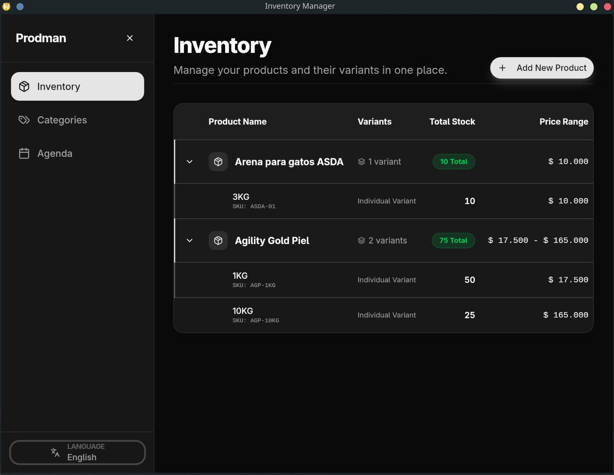
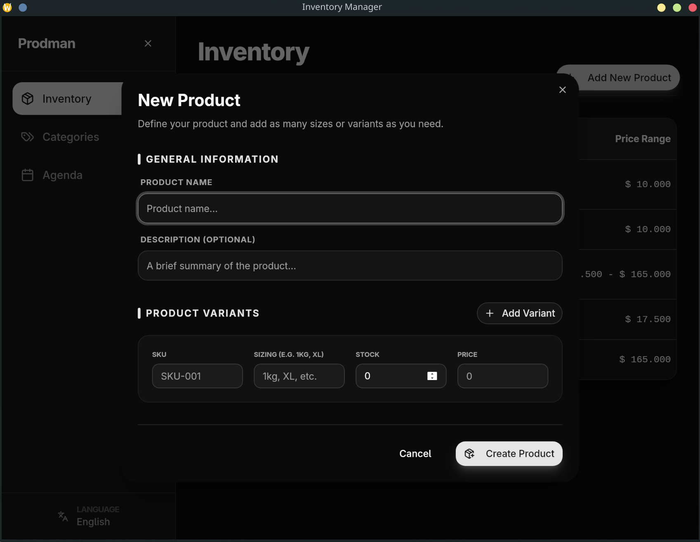

# Prodman: Modern Inventory & Product Manager

Prodman is a high-performance, desktop-first inventory management application built with **Go** and **React**. It is designed to handle complex product structures (like multi-sized variants) while maintaining a clean, professional user experience.

## 🖼 Screenshots

### Main Inventory View


### Add Product with Variants


## 🏗 Project Architecture

The project follows a **Clean Architecture** (Ports and Adapters) pattern on the backend, ensuring that the business logic remains independent of the database and UI frameworks.

### Backend (Go)
- **Core Domain:** Located in `internal/core/domain`, it defines our business entities (`Product`, `ItemVariant`, `Category`).
- **Ports:** Interfaces located in `internal/core/port` that define how the core logic interacts with external services (repositories).
- **Adapters:** Implementation details in `internal/adapter`.
  - **Repository:** Uses **GORM** with **SQLite** for persistent storage.
  - **Migrations:** Managed via **Goose** for versioned SQL schema updates.
- **Wails Bridge:** The `app.go` file acts as the bridge, exposing Go methods to the frontend as type-safe JavaScript functions.

### Frontend (React + TypeScript)
- **Data Management:** Powered by **TanStack Query (React Query)** for efficient caching, background synchronization, and declarative state management.
- **Styling:** Built with **Vanilla CSS** and **Tailwind CSS** (via Shadcn UI components) for a modern, responsive, and "alive" feel.
- **Internationalization (i18n):** Integrated with `react-i18next` supporting Spanish (default) and English.
- **Component Strategy:** Organized into atomic UI components and feature-based pages for high reusability.

## 💎 Key Design Decisions

### 1. Product-Variant Relationship (Parent-Child)
Unlike traditional flat inventory tables, Prodman splits data into two entities:
- **Products:** Shared metadata (Name, Description, Category).
- **Item Variants:** Physical inventory details (SKU, Sizing, Price, Stock).
This allows for a much more realistic management of goods like clothing (S, M, L) or food (1kg, 5kg) without duplicating base information.

### 2. Desktop-First Performance
By using **Wails**, the application runs as a native binary. Database operations happen locally on a SQLite file, ensuring zero latency and offline capability, which is critical for warehouse or retail environments.

### 3. Localization & Human-Centric UX
- **Dynamic Pricing:** We implemented a custom `formatPrice` utility that defaults to **COP (Colombian Pesos)**, handling local thousands separators and hiding unnecessary decimals for a cleaner look.
- **Expandable Inventory:** The UI uses an accordion-style table to group variants, reducing clutter while keeping details accessible.

## 🚀 Getting Started

### Prerequisites
- Go 1.25+
- Node.js 22+
- Wails CLI (`go install github.com/wailsapp/wails/v2/cmd/wails@latest`)

### Development
1. Install frontend dependencies:
   ```bash
   cd frontend && npm install
   ```
2. Run the application in development mode (with hot-reload):
   ```bash
   wails dev
   ```

## 🛠 Tech Stack
- **Language:** Go (Backend) / TypeScript (Frontend)
- **Framework:** Wails v2 (Desktop Bridge)
- **Database:** SQLite (via GORM)
- **State Management:** TanStack Query v5
- **Localization:** i18next
- **Icons:** Lucide React

## 📅 Roadmap / Scope
- [x] Product & Variant Database Schema
- [x] Multi-variant Product Creation Form
- [x] Grouped & Expandable Inventory View
- [x] Multi-language Support (ES/EN)
- [x] React Query Integration
- [ ] Category Management
- [ ] Transaction History & Stock Audit Logs
- [ ] Low Stock Alerts & Notifications
- [ ] Data Export (CSV/PDF)
